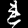
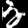
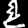

# KMNIST Semi-Supervised Classification

This repository contains the training and inference code I used for the Kaggle
competition [The Art of Computer Vision](https://www.kaggle.com/competitions/the-art-of-computer-vision) where i achieved Rank 1 of 15 Teams with a 0,975 Accuracy Score in the final Leaderboard.
The project focuses on learning useful embeddings from a small labeled KMNIST
set plus a larger unlabeled set, then combining classifier and prototype-based
predictions for submission generation.

## What is included

- PyTorch Lightning autoencoder/classifier model with supervised contrastive,
  reconstruction, classification, and consistency losses.
- Staged self-training workflow for selecting pseudo-labels and warm-starting
  follow-up training stages.
- Embedding analysis utilities for t-SNE/UMAP plots, prototype diagnostics, and
  validation method comparison.
- Submission generation with classifier, prototype, k-means, and ensemble
  prediction modes.

## Example images

These root-level PNG files are sample 28x28 grayscale KMNIST images:

<p>
  
  
  
  
  
  
  
  
  
  
  
</p>

## Repository layout

```text
kmnist/
  analysis/      Embedding extraction, projections, plots, and validation reports
  data/          Dataset and dataloader utilities for the competition files
  losses/        Embedding and contrastive losses
  models/        Autoencoder/classifier architecture
  submission/    Submission datasets, prediction logic, ensembling, and writers
  training/      Standard and staged self-training entry points
  utils/         Checkpoint, device, and path helpers
CONFIG.py        Central configuration for paths, model, training, and inference
```

Competition data, checkpoints, logs, and generated submissions are intentionally
ignored by Git. Place the Kaggle files under `Data/` with this structure:

```text
Data/
  Labeled/
  Unlabeled/
  Labeled-labels.csv
  sample-submission.csv
```

## Setup

This project uses Python 3.11 and `uv`.

```bash
uv sync
```

The default PyTorch index in `pyproject.toml` targets CUDA 12.6 wheels. Adjust
that index if you need a different CUDA or CPU-only PyTorch build.

## Common commands

Train the model:

```bash
uv run kmnist-train
```

Run staged self-training:

```bash
uv run kmnist-staged-train
```

Generate embedding diagnostics from the best available checkpoint:

```bash
uv run kmnist-analyze
```

Create a Kaggle submission:

```bash
uv run kmnist-submit
```

Start TensorBoard once Lightning logs exist:

```bash
uv run kmnist-tensorboard
```

Generated artifacts are written below `outputs/`.
